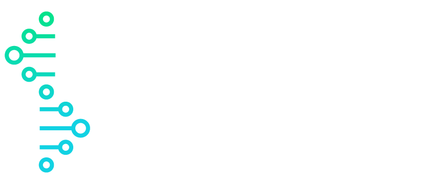

The UCD Cancer Data Lab, led by [Dr. Colm J. Ryan](), use large-scale data analysis to understand how genetic variation in cancer alters molecular interaction networks and to identify ways to target these alterations therapeutically.  

 

