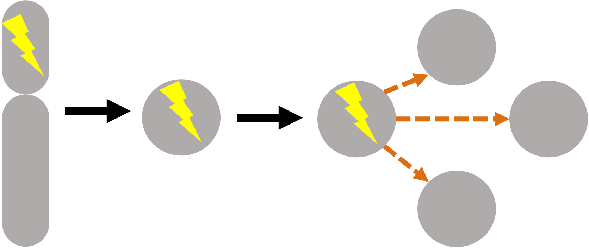

## Network rewiring in response to genetic perturbations in cancer

Genes, and their protein products, work in dense interconnected networks. A consequence of this is that the mutation of one gene in cancer often propagates through molecular interaction networks. For instance, the mutation of one member of a protein complex can result in altered protein abundance of the [entire protein complex](https://doi.org/10.1016/j.cels.2017.09.011). Likewise, the mutation of a transcription factor can result in the altered expression of many of that transcription factor’s targets. We are interested in developing integrative approaches to model and predict these downstream effects of mutations in cancer.