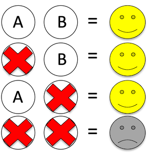

  
  

    Synthetic lethal interactions are identified when two genes can be perturbed individually with little or no fitness consequence but their combined perturbation results in cell death. In the context of cancer, synthetic lethal interactions can be exploited for the development of targeted therapeutics – targeting a synthetic lethal partner of a tumour suppressor gene can be a means to selectively kill tumour cells without harming healthy cells. The first therapies based on synthetic lethal interactions are now used in the clinic and large-scale experimental efforts are now underway to identify new synthetic lethal interactions. A major challenge to the identification of new synthetic lethal interactions is that <a href="https://doi.org/10.1016/j.trecan.2018.08.003">they appear to be highly context specific</a> – an interaction between two genes may be synthetic lethal only in a specific cell line or specific cancer type. We have <a href="https://doi.org/10.7554/eLife.58925">previously</a> <a href="https://doi.org/10.1016/j.cels.2021.08.006">developed</a> computational approaches to identify robust synthetic lethal interactions – those that operate across multiple contexts or cell lines. We are now interested in understanding what makes a gene pair likely to be synthetic lethal in a specific context and in developing machine learning models to predict in what contexts a given gene pair are likely to be synthetic lethal.

